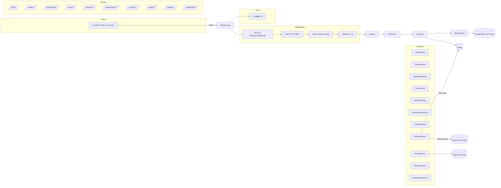

# Architecture Documentation

## Overview

This project follows a modular architecture pattern with clean separation of concerns, implementing industry best practices for maintainability, scalability, and testability.

## Diagrams (Mermaid)

### ERD (Entity Relationship Diagram)

```mermaid
erDiagram
  User ||--o{ Order : "assigned"
  User ||--o{ Shipment : "assigned"
  Vendor ||--o{ Order : "places"
  Fare ||--o{ Order : "priced_by"
  Warehouse ||--o{ Shipment : "handles"
  Order ||--o{ Shipment : "generates"

  User {
    string id PK
    string email
    string password
    string name
    enum role "ADMIN|MANAGER|USER"
    datetime createdAt
    datetime updatedAt
  }

  Vendor {
    string id PK
    string name
    string email
    string phone
    string address
    string city
    string state
    string country
    string postalCode
    boolean isActive
    datetime createdAt
    datetime updatedAt
  }

  Warehouse {
    string id PK
    string name
    string address
    string city
    string state
    string country
    string postalCode
    int capacity
    boolean isActive
    datetime createdAt
    datetime updatedAt
  }

  Fare {
    string id PK
    string fromCity
    string toCity
    float branchDelivery
    float codBranch
    float doorDelivery
    boolean isActive
    datetime createdAt
    datetime updatedAt
  }

  Order {
    string id PK
    string orderNumber UNIQUE
    string vendorId FK
    string userId FK "nullable"
    enum status "PENDING|CONFIRMED|PROCESSING|SHIPPED|DELIVERED|CANCELLED|RETURNED"
    string deliveryCity
    string deliveryAddress
    string contactNumber
    string name
    string alternateContactNumber "nullable"
    float amountToBeCollected "nullable"
    enum deliveryType "BRANCH_DELIVERY|COD_BRANCH|DOOR_DELIVERY"
    string fareId FK
    float productWeight
    string productType
    float totalAmount
    string notes "nullable"
    datetime createdAt
    datetime updatedAt
  }

  Shipment {
    string id PK
    string trackingNumber UNIQUE
    string orderId FK
    string warehouseId FK
    string userId FK "nullable"
    enum status "PREPARING|PICKED_UP|IN_TRANSIT|OUT_FOR_DELIVERY|DELIVERED|FAILED_DELIVERY|RETURNED"
    string carrier "nullable"
    string trackingUrl "nullable"
    datetime estimatedDelivery "nullable"
    datetime actualDelivery "nullable"
    float weight "nullable"
    json dimensions "nullable"
    string notes "nullable"
    datetime createdAt
    datetime updatedAt
  }
```

### ARD (Architecture/Runtime Diagram)



## Project Structure

```
src/
├── config/              # Configuration files
│   ├── database.js      # Database configuration
│   ├── index.js         # Main configuration
│   └── swagger.js       # Swagger documentation config
├── constants/           # Application constants and enums
│   └── index.js         # All constants and enums
├── controllers/         # Request/Response handling
│   ├── AuthController.js
│   ├── OrderController.js
│   └── ...
├── dtos/               # Data Transfer Objects
│   ├── BaseDTO.js
│   ├── UserDTO.js
│   ├── OrderDTO.js
│   └── ...
├── errors/             # Custom error classes
│   ├── AppError.js
│   └── index.js
├── interfaces/         # TypeScript interfaces (if using TS)
├── middleware/         # Express middleware
│   ├── auth.js
│   ├── errorHandler.js
│   └── validation.js
├── repositories/       # Data access layer
│   ├── BaseRepository.js
│   ├── UserRepository.js
│   ├── OrderRepository.js
│   └── ...
├── routes/             # API routes
│   ├── auth.js
│   ├── orders.js
│   ├── vendors.js
│   └── ...
├── services/           # Business logic layer
│   ├── BaseService.js
│   ├── AuthService.js
│   ├── OrderService.js
│   └── ...
├── types/              # TypeScript type definitions
├── utils/              # Utility functions
│   ├── logger.js
│   ├── response.js
│   └── validation.js
├── validators/         # Input validation schemas
│   ├── authValidator.js
│   ├── orderValidator.js
│   └── ...
├── server.js           # Application entry point
└── seed.js             # Database seeding
```

## Architecture Layers

### 1. Controllers Layer
- **Purpose**: Handle HTTP requests and responses
- **Responsibilities**:
  - Extract data from requests
  - Call appropriate service methods
  - Format responses
  - Handle errors

### 2. Services Layer
- **Purpose**: Implement business logic
- **Responsibilities**:
  - Business rule validation
  - Data processing and transformation
  - Orchestrating multiple repository calls
  - Complex business operations

### 3. Repository Layer
- **Purpose**: Data access abstraction
- **Responsibilities**:
  - Database operations
  - Query building
  - Data mapping
  - Database-specific logic

### 4. DTOs (Data Transfer Objects)
- **Purpose**: Data structure definition and validation
- **Responsibilities**:
  - Define data contracts
  - Data transformation
  - Input/output validation
  - API response formatting

## Design Patterns

### 1. Repository Pattern
```javascript
class BaseRepository {
  async create(data) { /* ... */ }
  async findById(id) { /* ... */ }
  async findMany(where, options) { /* ... */ }
  async update(id, data) { /* ... */ }
  async delete(id) { /* ... */ }
}
```

### 2. Service Layer Pattern
```javascript
class BaseService {
  constructor(repository) {
    this.repository = repository;
  }
  
  async create(data) { /* ... */ }
  async findById(id) { /* ... */ }
  // ... other methods
}
```

### 3. DTO Pattern
```javascript
class UserDTO extends BaseDTO {
  static createUser(data) { /* ... */ }
  static response(user) { /* ... */ }
  static authResponse(user, token) { /* ... */ }
}
```

### 4. Error Handling Pattern
```javascript
class AppError extends Error {
  constructor(message, statusCode, isOperational = true) {
    super(message);
    this.statusCode = statusCode;
    this.isOperational = isOperational;
  }
}
```

## Key Features

### 1. Error Handling
- Custom error classes with proper HTTP status codes
- Centralized error handling middleware
- Operational vs programming error distinction
- Detailed error logging

### 2. Validation
- Joi-based input validation
- Centralized validation schemas
- Custom validation helpers
- Detailed error messages

### 3. Logging
- Winston-based structured logging
- Different log levels (error, warn, info, debug)
- File and console logging
- Request/response logging

### 4. Response Formatting
- Consistent API response structure
- Success/error response helpers
- Pagination support
- Standardized error messages

### 5. Authentication & Authorization
- JWT-based authentication
- Role-based access control
- Middleware-based protection
- Token validation and refresh

## Best Practices Implemented

### 1. Separation of Concerns
- Each layer has a single responsibility
- Clear boundaries between layers
- Loose coupling between components

### 2. Dependency Injection
- Services depend on abstractions (repositories)
- Easy to mock for testing
- Flexible and maintainable

### 3. Error Handling
- Custom error classes
- Proper HTTP status codes
- Detailed error messages
- Error logging and monitoring

### 4. Validation
- Input validation at controller level
- Business rule validation in services
- Database constraint validation
- Comprehensive error messages

### 5. Logging
- Structured logging with Winston
- Different log levels
- Request/response logging
- Error tracking

### 6. Configuration Management
- Environment-based configuration
- Centralized config files
- Type-safe configuration
- Default values and validation

### 7. API Documentation
- Swagger/OpenAPI documentation
- Interactive API explorer
- Comprehensive schemas
- Example requests/responses

## Benefits

### 1. Maintainability
- Clear code organization
- Easy to locate and modify code
- Consistent patterns throughout
- Well-documented code

### 2. Scalability
- Modular architecture
- Easy to add new features
- Horizontal scaling support
- Performance optimization

### 3. Testability
- Dependency injection
- Mockable components
- Unit test friendly
- Integration test support

### 4. Security
- Input validation
- Authentication/authorization
- Error handling
- Security headers

### 5. Developer Experience
- Clear project structure
- Comprehensive documentation
- Interactive API docs
- Consistent patterns

## Getting Started

1. **Install Dependencies**
   ```bash
   npm install
   ```

2. **Setup Environment**
   ```bash
   cp env.example .env
   # Edit .env with your configuration
   ```

3. **Setup Database**
   ```bash
   npm run db:push
   npm run db:seed
   ```

4. **Start Development Server**
   ```bash
   npm run dev
   ```

5. **Access API Documentation**
   - Swagger UI: http://localhost:3000/api-docs
   - Health Check: http://localhost:3000/api/health

## Contributing

When adding new features:

1. Create DTOs for data structures
2. Implement repository for data access
3. Create service for business logic
4. Add controller for HTTP handling
5. Create routes and validation
6. Add comprehensive tests
7. Update documentation

## Testing

The architecture supports:
- Unit testing (services, repositories)
- Integration testing (API endpoints)
- End-to-end testing (full workflows)
- Mock testing (external dependencies)

## Monitoring

- Structured logging with Winston
- Error tracking and reporting
- Performance monitoring
- Health check endpoints
