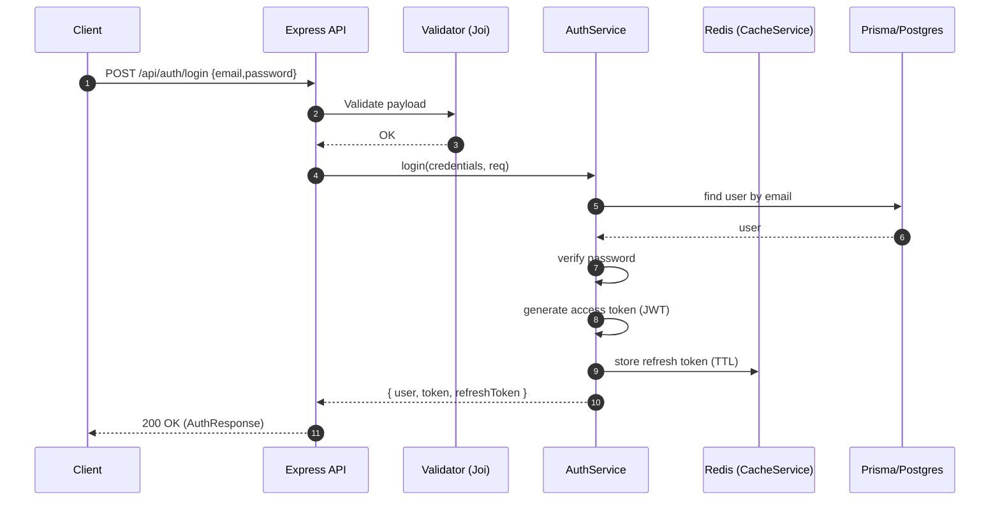

# Authentication Flow

```mermaid
sequenceDiagram
  autonumber
  participant C as Client
  participant API as Express API
  participant V as Validator (Joi)
  participant S as AuthService
  participant R as Redis (CacheService)
  participant DB as Prisma/Postgres
  C->>API: POST /api/auth/login {email,password}
  API->>V: Validate payload
  V-->>API: OK
  API->>S: login(credentials, req)
  S->>DB: find user by email
  DB-->>S: user
  S->>S: verify password
  S->>S: generate access token (JWT)
  S->>R: store refresh token (TTL)
  S-->>API: { user, token, refreshToken }
  API-->>C: 200 OK (AuthResponse)
```
