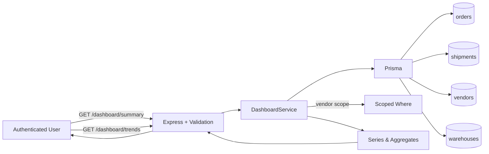

# Dashboard Overview

```mermaid
flowchart LR
  U[Authenticated User] -->|GET /dashboard/summary| API
  U -->|GET /dashboard/trends| API
  API[Express + Validation] --> DS[DashboardService]
  DS --> PRISMA[Prisma]
  PRISMA --> ORDERS[(orders)]
  PRISMA --> SHIPMENTS[(shipments)]
  PRISMA --> VENDORS[(vendors)]
  PRISMA --> WAREHOUSES[(warehouses)]
  DS -->|vendor scope| SC[Scoped Where]
  DS --> AGG[Series & Aggregates]
  AGG --> API
  API --> U
```
