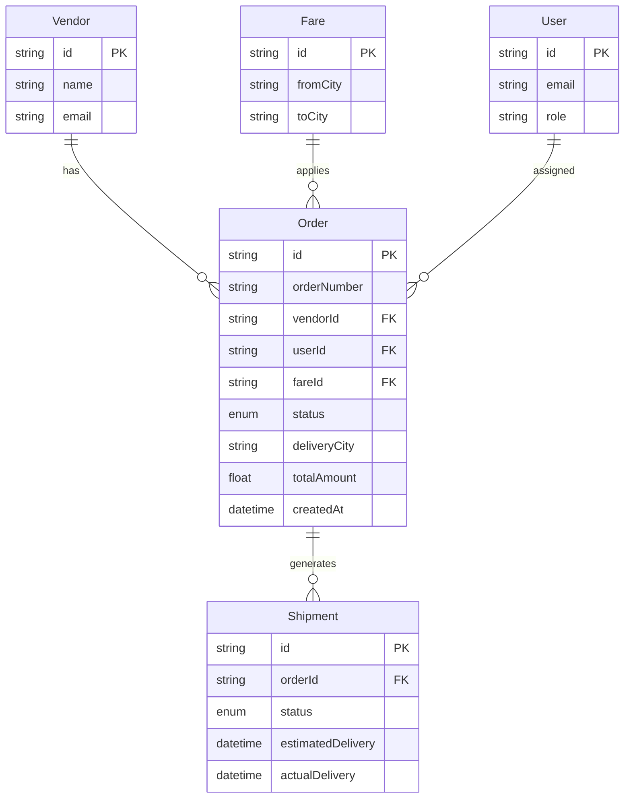

# Order-Centric ERD

```mermaid
erDiagram
  Vendor ||--o{ Order : has
  Fare ||--o{ Order : applies
  User ||--o{ Order : assigned
  Order ||--o{ Shipment : generates

  Vendor {
    string id PK
    string name
    string email
  }

  Fare {
    string id PK
    string fromCity
    string toCity
  }

  User {
    string id PK
    string email
    string role
  }

  Order {
    string id PK
    string orderNumber
    string vendorId FK
    string userId FK
    string fareId FK
    enum status
    string deliveryCity
    float totalAmount
    datetime createdAt
  }

  Shipment {
    string id PK
    string orderId FK
    enum status
    datetime estimatedDelivery
    datetime actualDelivery
  }
```
