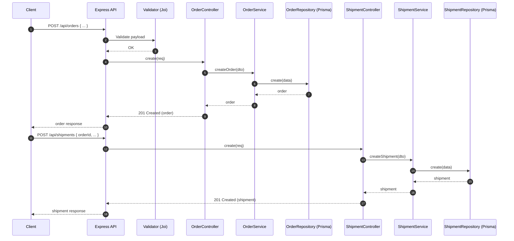

# Order Flow (Create → Ship → Deliver)

```mermaid
sequenceDiagram
  autonumber
  participant C as Client
  participant API as Express API
  participant V as Validator (Joi)
  participant OC as OrderController
  participant OS as OrderService
  participant OR as OrderRepository (Prisma)
  participant SC as ShipmentController
  participant SS as ShipmentService
  participant SR as ShipmentRepository (Prisma)

  C->>API: POST /api/orders { ... }
  API->>V: Validate payload
  V-->>API: OK
  API->>OC: create(req)
  OC->>OS: createOrder(dto)
  OS->>OR: create(data)
  OR-->>OS: order
  OS-->>OC: order
  OC-->>API: 201 Created (order)
  API-->>C: order response

  C->>API: POST /api/shipments { orderId, ... }
  API->>SC: create(req)
  SC->>SS: createShipment(dto)
  SS->>SR: create(data)
  SR-->>SS: shipment
  SS-->>SC: shipment
  SC-->>API: 201 Created (shipment)
  API-->>C: shipment response
```
