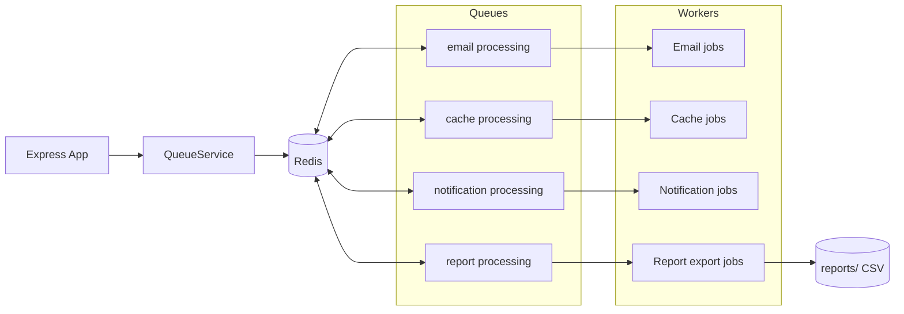

# Queue Architecture

```mermaid
flowchart LR
  API[Express App] --> QS[QueueService]
  QS --> REDIS[(Redis)]
  subgraph Queues
    E[email processing]
    C[cache processing]
    N[notification processing]
    R[report processing]
  end
  REDIS <---> E
  REDIS <---> C
  REDIS <---> N
  REDIS <---> R
  subgraph Workers
    WE[Email jobs]
    WC[Cache jobs]
    WN[Notification jobs]
    WR[Report export jobs]
  end
  E --> WE
  C --> WC
  N --> WN
  R --> WR
  WR --> FS[(reports/ CSV)]
```
