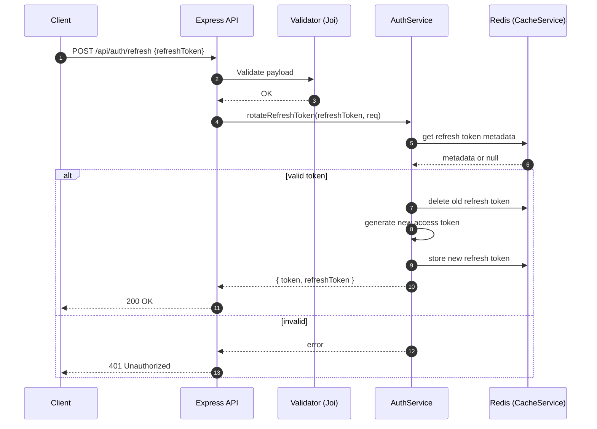

# Refresh Token Rotation Flow

```mermaid
sequenceDiagram
  autonumber
  participant C as Client
  participant API as Express API
  participant V as Validator (Joi)
  participant S as AuthService
  participant R as Redis (CacheService)
  C->>API: POST /api/auth/refresh {refreshToken}
  API->>V: Validate payload
  V-->>API: OK
  API->>S: rotateRefreshToken(refreshToken, req)
  S->>R: get refresh token metadata
  R-->>S: metadata or null
  alt valid token
    S->>R: delete old refresh token
    S->>S: generate new access token
    S->>R: store new refresh token
    S-->>API: { token, refreshToken }
    API-->>C: 200 OK
  else invalid
    S-->>API: error
    API-->>C: 401 Unauthorized
  end
```
