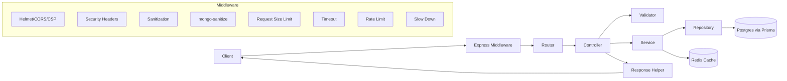

# HTTP Request Lifecycle

```mermaid
flowchart LR
  C[Client] --> MW[Express Middleware]
  subgraph Middleware
    H[Helmet/CORS/CSP]
    SEC[Security Headers]
    SAN[Sanitization]
    SQL[mongo-sanitize]
    SIZE[Request Size Limit]
    TIME[Timeout]
    RATE[Rate Limit]
    SPEED[Slow Down]
  end
  MW --> RT[Router]
  RT --> CTRL[Controller]
  CTRL --> VAL[Validator]
  CTRL --> SRV[Service]
  SRV --> REPO[Repository]
  REPO --> DB[(Postgres via Prisma)]
  SRV --> REDIS[(Redis Cache)]
  CTRL --> RES[Response Helper]
  RES --> C
```
