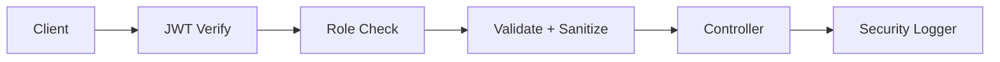

# Security Overview

- Authentication: JWT access tokens + opaque refresh tokens (Redis TTL, rotation)
- Authorization: Role-based (ADMIN, MANAGER, USER) with route guards
- Input Hardening: Joi validation, XSS sanitize, express-mongo-sanitize
- Rate Control: express-rate-limit + express-slow-down (v2 delay function)
- Headers: Helmet + custom headers (CSP, X-Frame-Options, X-Content-Type-Options, X-XSS-Protection)
- Logging: Security and audit logs with endpoints for metrics and viewing
- IP & Size Controls: Request size limit, optional IP filtering, request timeout

## Refresh Token Security
- Opaque random token (48 bytes hex)
- Stored server-side in Redis with TTL (REFRESH_TOKEN_TTL_SECONDS)
- Rotation on refresh; old token invalidated
- Security logs for rotate/fail events

## CSP & Headers
- CSP restricts script/style/img/connect/frame-ancestors/base-uri/form-action
- X-Frame-Options: DENY; X-Content-Type-Options: nosniff; X-XSS-Protection enabled

## Brute Force Mitigation
- General and auth-specific rate limits
- Speed limiting with incremental delay per request above threshold
